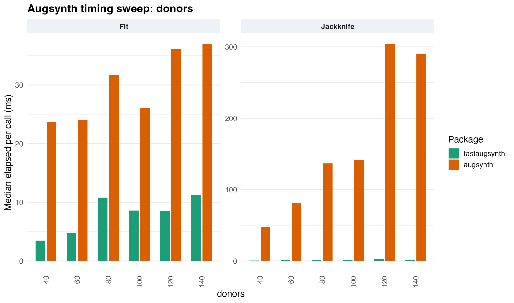
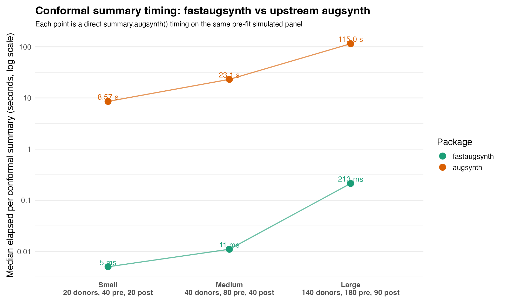
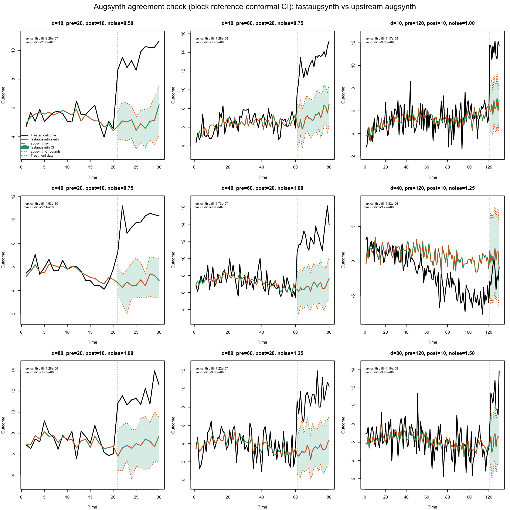

# fastaugsynth

`fastaugsynth` is an experimental R package that keeps the upstream `augsynth`-style API but routes the heavy work through a compiled Julia backend.

This repository was built with heavy AI assistance. The current package should be viewed as an AI-assisted Julia/R port of `augsynth`, with a small number of explicit algorithmic changes for speed and validation.

## Scope

`fastaugsynth` is currently focused on one narrow goal: be a very fast `augsynth` implementation for R while staying close to upstream behavior.

Current surface:

- `augsynth()`
- `summary.augsynth()` for jackknife and conformal inference
- `predict.augsynth()`
- low-level dense regression helpers `jols_fit_xy()` and `jridge_fit_xy()`

Not implemented:

- multisynth / staggered-adoption paths
- multi-outcome support
- broad “general econometrics toolbox” ambitions

## Installation

The package name and GitHub repo slug are both `fastaugsynth`.

```r
if (!requireNamespace("remotes", quietly = TRUE)) install.packages("remotes")

Sys.setenv(GITHUB_PAT = "<token with repo access>")

remotes::install_github(
  "jamesbrandecon/fastaugsynth"
)

library(fastaugsynth)

if (!fastaugsynth::backend_status()$exists) {
  fastaugsynth::backend_install()
}
```

The repo root is the R package root. The Julia backend, docs, and temp benchmarking material stay in the repo but are excluded from the package build.

If you are testing a non-default branch, set the backend ref explicitly before install or before `backend_install()`:

```r
Sys.setenv(FASTAUGSYNTH_BACKEND_REF = "<branch-name>")
```

Artifact lookup uses:

- `FASTAUGSYNTH_BACKEND_LIB`
- `FASTAUGSYNTH_GITHUB_PAT`
- `FASTAUGSYNTH_BACKEND_REF`
- `FASTAUGSYNTH_JULIA_THREADS`

The package will also use `GITHUB_PAT`, `gh auth token`, or `gitcreds` when needed.

## Quick Start

```r
fit <- fastaugsynth::augsynth(
  outcome ~ trt,
  unit = unit_id,
  time = period,
  data = panel,
  progfunc = "None",
  scm = TRUE,
  t_int = treatment_start
)

summary(fit, inf = TRUE, inf_type = "jackknife")
summary(fit, inf = TRUE, inf_type = "conformal")

# closer-to-upstream validation mode
summary(
  fit,
  inf = TRUE,
  inf_type = "conformal",
  type = "block",
  conformal_mode = "reference"
)
```

Embedded Julia thread count can be controlled with:

```r
Sys.setenv(FASTAUGSYNTH_JULIA_THREADS = "auto")
fastaugsynth:::backend_thread_count()
```

## Benchmarks

The package story is simplest in pictures.

This donor-sweep benchmark fixes `180` pre-treatment periods and `90` post-treatment periods and compares `fastaugsynth` against upstream `augsynth` on estimation and jackknife inference:



This figure covers estimation and jackknife only; it does not include conformal.

On that donor sweep, jackknife summary currently ranges from about `4.2 ms` to `10.9 ms` for `fastaugsynth` versus about `81.7 ms` to `347.3 ms` for upstream `augsynth`.

A separate conformal-only comparison benchmarks direct `summary.augsynth(..., inf_type = "conformal")` calls on three simulated panels:



On those three cases, `fastaugsynth` currently takes about `6 ms`, `82 ms`, and `360 ms`, versus about `8.78 s`, `23.7 s`, and `118.4 s` for upstream `augsynth`.

Within `fastaugsynth` on that larger case, the isolated joint multi-post `iid` kernel is about `48.4 ms` on `1` Julia thread and about `12.8 ms` on `6` Julia threads.

That is the important distinction in the current implementation:

- the full pointwise conformal summary is already dominated by exact single-post work and stays fast on one thread
- Julia threading helps more on the true multi-post `iid` permutation path

Reproduction scripts live in [inst/benchmarks/README.md](inst/benchmarks/README.md).

## Agreement With Upstream

Default conformal outputs are not expected to match exactly. In `fast` mode, `fastaugsynth` uses exact single-post `iid` conformal p-values and an adaptive CI search, while upstream `augsynth` uses Monte Carlo `iid` p-values and a fixed grid search. Those choices can move pointwise p-values and interval endpoints slightly, especially under `type = "iid"`.

The validation panel below therefore uses `type = "block"` and `conformal_mode = "reference"` to remove the `iid` Monte Carlo noise and align the conformal search path with upstream.

This 3x3 validation panel compares `fastaugsynth::augsynth()` and upstream `augsynth::augsynth()` across 9 simulated datasets using:

- `type = "block"`
- `conformal_mode = "reference"`



For that run:

- max synthetic-path difference: `1.82e-6`
- max ATT-path difference: `1.82e-6`
- max counterfactual CI lower-bound difference: `1.33e-6`
- max counterfactual CI upper-bound difference: `3.77e-6`

The figure inputs and diagnostics are checked into [docs/benchmarks/agreement/](docs/benchmarks/agreement/).

## Why It Is Faster

Current implementation differences that matter for runtime:

1. Single-post `iid` conformal tests use the exact permutation distribution instead of Monte Carlo approximation.
2. SCM/QP subproblems are cached and warm-started in Julia rather than repeatedly rebuilt from R.
3. The fast conformal path can use adaptive CI search.
4. The whole hot inference loop stays in compiled code.
5. Multi-post `iid` work can use Julia threading.

## Relationship To Upstream `augsynth`

The package intentionally keeps the familiar upstream function names and general API shape:

- `augsynth()`
- `summary.augsynth()`
- `predict.augsynth()`

But it is not the upstream package. It is best understood as:

- a separate implementation
- heavily AI-assisted
- validated against upstream
- still experimental

If you care most about close behavioral matching rather than maximum speed, use validation settings like `type = "block"` and `conformal_mode = "reference"`.

## Repository Layout

- [backend/](backend): Julia backend and PackageCompiler build
- [R/](R), [src/](src), [tests/](tests), and [inst/](inst): R package source for `fastaugsynth`
- [inst/benchmarks/](inst/benchmarks): benchmark runners and benchmark notes
- [docs/benchmarks/agreement/](docs/benchmarks/agreement/): agreement figure inputs and diagnostics

## CI

The GitHub Actions workflow builds the backend artifact and checks that the R package can install and run against that artifact without requiring Julia on the runtime worker.
