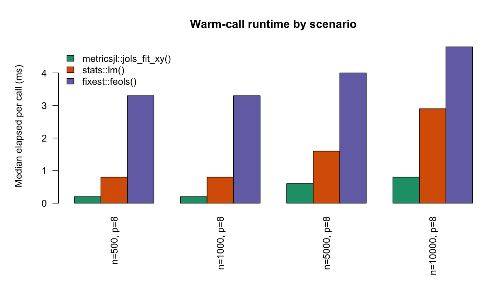
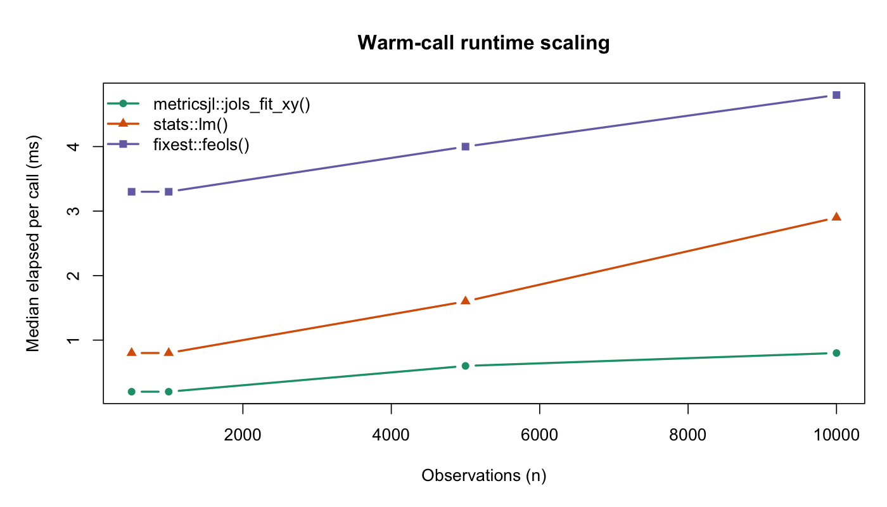

# `jols_fit_xy()`, `lm()`, and `feols()` Benchmarks

This folder contains a standalone benchmark runner for comparing the compiled Julia-backed OLS entrypoint `jols_fit_xy()` against both base R's formula interface `lm()` and `fixest::feols()`.

## What it does

- benchmarks four fixed `n x p` scenarios with `p = 8`
- validates that `jols_fit_xy()`, `lm()`, and `feols()` return matching coefficients before recording timings
- writes raw timing data and summarized medians to `results/`
- writes a grouped bar chart and a scaling line chart to `figures/`

## Caveat

This benchmark compares:

- `jols_fit_xy(X, y)`, a low-level matrix API
- `lm(y ~ ., data = df)`, the full formula/data-frame API
- `fixest::feols(y ~ ., data = df)`, a high-performance econometrics-focused formula API

That makes this useful as an end-user latency comparison, not a solver-only comparison. `feols()` is a stronger baseline than `lm()`, and `lm.fit()` would still be the cleaner low-level reference if you want to isolate only the numerical kernel.

## Run It

Install the source tree under `statlibR/` as package `metricsjl`, point `METRICSJL_BACKEND_LIB` at a built backend library, and run:

```bash
R CMD INSTALL -l /tmp/metricsjl-lib statlibR
R_LIBS=/tmp/metricsjl-lib \
METRICSJL_BACKEND_LIB=/absolute/path/to/libstatlibbackend.dylib \
Rscript statlibR/inst/benchmarks/benchmark_ols_vs_lm.R \
  --output-dir statlibR/inst/benchmarks \
  --reps 12 \
  --batch-size 5
```

The script also requires `fixest`.

On Linux, swap the library filename to `libstatlibbackend.so`.

## Outputs

- `results/ols_vs_lm_timings.csv`: raw per-run timings for all three methods
- `results/ols_vs_lm_summary.csv`: cold and warm timing summaries
- `results/ols_vs_lm_speedup.csv`: warm median timing table and ratios against `jols_fit_xy()`
- `results/benchmark_metadata.txt`: backend path and runtime metadata
- `figures/ols_vs_lm_bar.png`: grouped warm-runtime bar chart
- `figures/ols_vs_lm_line.png`: warm-runtime scaling line chart

## `augsynth`, `metricsjl`, and `gsynth` Benchmark

This folder also supports a single-case comparison script for synthetic control-style estimation:

- `metricsjl::augsynth()` (compiled backend)
- `augsynth::augsynth()` (reference R implementation)
- `gsynth::gsynth()` (if available; optional)

Run:

```bash
R CMD INSTALL -l /tmp/metricsjl-lib statlibR
R_LIBS=/tmp/metricsjl-lib \
METRICSJL_BACKEND_LIB=/absolute/path/to/libstatlibbackend.dylib \
Rscript statlibR/inst/benchmarks/benchmark_augsynth_vs_gsynth.R \
  --output-dir statlibR/inst/benchmarks \
  --reps 20
```

Use `--skip-gsynth` if gsynth is not installed.

## `augsynth` vs `gsynth` Outputs

- `results/augsynth_vs_gsynth_timings.csv`: per-iteration raw timings in milliseconds
- `results/augsynth_vs_gsynth_summary.csv`: averaged summaries and speedup against `metricsjl`
- `results/benchmark_metadata.txt`: run metadata, package versions, and backend path

## Current Charts

These checked-in figures were generated on `2026-04-08` with:

- `R 4.5.2`
- `fixest 0.13.2`
- `aarch64-apple-darwin20`
- `12` benchmark repetitions
- `5` inner iterations per warm timing sample

They are machine-specific and should be regenerated on the target machine before making any performance claims.

## Current Warm-Median Results

The exact raw numbers are in `results/ols_vs_lm_speedup.csv` and `results/ols_vs_lm_summary.csv`.

| Scenario | `jols_fit_xy()` | `lm()` | `feols()` | `lm() / jols_fit_xy()` | `feols() / jols_fit_xy()` |
| --- | ---: | ---: | ---: | ---: | ---: |
| `n=500, p=8` | `0.20 ms` | `0.80 ms` | `3.30 ms` | `4.00x` | `16.50x` |
| `n=1000, p=8` | `0.20 ms` | `0.80 ms` | `3.30 ms` | `4.00x` | `16.50x` |
| `n=5000, p=8` | `0.60 ms` | `1.60 ms` | `4.00 ms` | `2.67x` | `6.67x` |
| `n=10000, p=8` | `0.80 ms` | `2.90 ms` | `4.80 ms` | `3.62x` | `6.00x` |

On this machine, `feols()` is slower for these cases because the workload is just plain dense OLS with no fixed effects, so its richer formula/econometrics machinery does more setup than the low-level matrix call and even more than `lm()`. That does not imply `feols()` is weak overall; it means this specific benchmark is stressing a narrower path than the one `fixest` is optimized to dominate.




